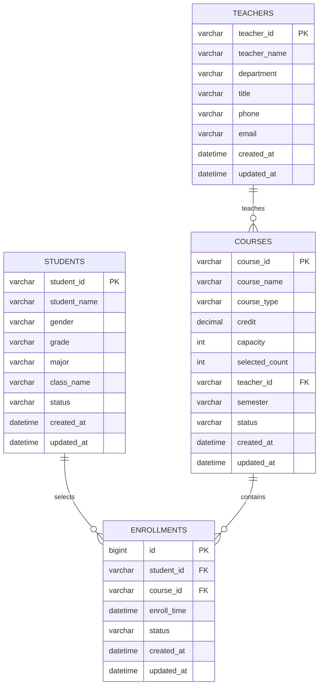

# 高校选课管理系统分析及设计文档

## 一、文档说明

本文档基于高校选课管理系统的基础功能需求，围绕学生选课数据处理、SQL统计、核心数据模型、并发风险和索引设计进行简化分析与设计。

系统主要实现以下功能：

1. 学生选课记录批量导入；
2. 学生选课记录去重；
3. 学生选课记录排序；
4. 按课程类型分类；
5. 按学生ID、课程ID、课程名称、课程类型检索；
6. 简单页面展示选课数据；
7. 对选课业务中的数据库模型、并发风险和索引进行分析。

---

# 二、核心数据模型设计

本系统围绕高校选课业务，设计以下核心数据表：

1. 学生表：`students`
2. 教师表：`teachers`
3. 课程表：`courses`
4. 选课记录表：`enrollments`

其中，学生和课程之间是多对多关系，需要通过选课记录表进行关联；教师和课程之间是一对多关系，一个教师可以教授多门课程。

---

## 1. 学生表：students

| 字段名 | 数据类型 | 说明 |
|---|---|---|
| student_id | VARCHAR(20) | 学生ID，主键，例如 S000001 |
| student_name | VARCHAR(50) | 学生姓名 |
| gender | VARCHAR(10) | 性别 |
| grade | VARCHAR(20) | 年级 |
| major | VARCHAR(50) | 专业 |
| class_name | VARCHAR(50) | 班级 |
| status | VARCHAR(20) | 学籍状态，例如正常、休学、毕业 |
| created_at | DATETIME | 创建时间 |
| updated_at | DATETIME | 更新时间 |

说明：

学生表用于保存学生的基础信息。`student_id` 是学生的唯一标识，在选课记录表中作为外键使用。

---

## 2. 教师表：teachers

| 字段名 | 数据类型 | 说明 |
|---|---|---|
| teacher_id | VARCHAR(20) | 教师ID，主键，例如 T000001 |
| teacher_name | VARCHAR(50) | 教师姓名 |
| department | VARCHAR(50) | 所属学院或部门 |
| title | VARCHAR(50) | 职称，例如讲师、副教授、教授 |
| phone | VARCHAR(20) | 联系电话 |
| email | VARCHAR(100) | 邮箱 |
| created_at | DATETIME | 创建时间 |
| updated_at | DATETIME | 更新时间 |

说明：

教师表用于保存教师的基础信息。一个教师可以教授多门课程，因此教师表和课程表之间是一对多关系。

---

## 3. 课程表：courses

| 字段名 | 数据类型 | 说明 |
|---|---|---|
| course_id | VARCHAR(20) | 课程ID，主键，例如 C000001 |
| course_name | VARCHAR(50) | 课程名称 |
| course_type | VARCHAR(20) | 课程类型，例如公共课、专业课、选修课 |
| credit | DECIMAL(3,1) | 学分 |
| capacity | INT | 课程容量 |
| selected_count | INT | 当前已选人数 |
| teacher_id | VARCHAR(20) | 授课教师ID，外键 |
| semester | VARCHAR(20) | 开课学期 |
| status | VARCHAR(20) | 课程状态，例如开放选课、已关闭 |
| created_at | DATETIME | 创建时间 |
| updated_at | DATETIME | 更新时间 |

说明：

课程表用于保存课程信息。其中 `capacity` 表示课程最大容量，`selected_count` 表示当前已选人数。  
在选课高峰期，需要重点保证 `selected_count` 不会超过 `capacity`。

---

## 4. 选课记录表：enrollments

| 字段名 | 数据类型 | 说明 |
|---|---|---|
| id | BIGINT | 主键ID |
| student_id | VARCHAR(20) | 学生ID，外键 |
| course_id | VARCHAR(20) | 课程ID，外键 |
| enroll_time | DATETIME | 选课时间 |
| status | VARCHAR(20) | 选课状态，例如已选、退选 |
| created_at | DATETIME | 创建时间 |
| updated_at | DATETIME | 更新时间 |

说明：

选课记录表用于保存学生和课程之间的选课关系。  
由于一个学生可以选择多门课程，一门课程也可以被多个学生选择，因此学生表和课程表之间是多对多关系，需要通过 `enrollments` 表进行关联。

---

# 三、表间关系说明

系统中的主要表关系如下：

```text
students 1 ---- N enrollments N ---- 1 courses N ---- 1 teachers
```

具体说明如下：

1. 一个学生可以有多条选课记录；
2. 一条选课记录只属于一个学生；
3. 一门课程可以被多个学生选择；
4. 一条选课记录只对应一门课程；
5. 一个教师可以教授多门课程；
6. 一门课程通常对应一名授课教师。

---

# 四、ER 图

下面使用 Mermaid 语法描述系统 ER 图。



---

# 五、SQL 编程题答案

## 题目 1：统计每门课程的选课人数

需求：

统计每门课程的选课人数，返回课程ID、课程名称、选课人数，选课人数别名为 `enroll_count`，结果按选课人数降序排序。

SQL 语句如下：

```sql
SELECT
    c.course_id,
    c.course_name,
    COUNT(e.student_id) AS enroll_count
FROM courses c
LEFT JOIN enrollments e ON c.course_id = e.course_id
GROUP BY c.course_id, c.course_name
ORDER BY enroll_count DESC;
```

说明：

1. 使用 `LEFT JOIN` 连接课程表和选课记录表；
2. 使用 `COUNT(e.student_id)` 统计每门课程的选课人数；
3. 使用 `GROUP BY` 按课程进行分组；
4. 使用 `ORDER BY enroll_count DESC` 按选课人数降序排序；
5. 使用 `LEFT JOIN` 的好处是，即使某门课程暂无学生选择，也可以显示出来。

---

## 题目 2：统计选课人数超过 50 人的专业课

需求：

统计选课人数超过 50 人的专业课，返回课程ID、课程名称、选课人数，结果按选课人数升序排序。

SQL 语句如下：

```sql
SELECT
    c.course_id,
    c.course_name,
    COUNT(e.student_id) AS enroll_count
FROM courses c
JOIN enrollments e ON c.course_id = e.course_id
WHERE c.course_type = '专业课'
GROUP BY c.course_id, c.course_name
HAVING COUNT(e.student_id) > 50
ORDER BY enroll_count ASC;
```

说明：

1. 使用 `JOIN` 连接课程表和选课记录表；
2. 使用 `WHERE c.course_type = '专业课'` 筛选专业课；
3. 使用 `COUNT(e.student_id)` 统计选课人数；
4. 使用 `HAVING COUNT(e.student_id) > 50` 筛选选课人数超过 50 的课程；
5. 使用 `ORDER BY enroll_count ASC` 按选课人数升序排序。

---

# 六、并发风险分析

## 1. 核心并发问题：课程超选

在选课高峰期，大量学生可能同时选择同一门课程。  
如果系统没有做好并发控制，就可能出现课程实际选课人数超过课程容量的问题。

例如，某门课程容量为 50 人，当前已选人数为 49 人。  
如果学生 A 和学生 B 同时点击选课，可能出现如下情况：

```text
学生A查询：当前49人，可以选
学生B查询：当前49人，可以选
学生A选课成功，人数变为50
学生B选课成功，人数变为51
```

最终导致课程人数超过容量限制，这就是课程超选问题。

---

## 2. 课程超选产生的原因

课程超选的根本原因是多个请求同时读取到了相同的旧数据。

也就是说，多个学生同时查询课程剩余名额时，都认为课程还有空位，于是都执行了插入选课记录和更新已选人数的操作。

如果这些操作没有放在事务中统一控制，就会造成数据不一致。

---

## 3. 简单可行的解决方案

可以使用以下方案：

```text
数据库事务 + 行级锁 + 唯一索引
```

其中：

1. 数据库事务用于保证选课操作的完整性；
2. 行级锁用于锁住当前课程记录，避免多个请求同时修改同一门课程；
3. 唯一索引用于防止同一学生重复选择同一门课程。

---

## 4. 基本处理流程

示例 SQL 如下：

```sql
START TRANSACTION;

SELECT capacity, selected_count
FROM courses
WHERE course_id = 'C000001'
FOR UPDATE;

-- 如果 selected_count < capacity，则允许选课
-- 如果 selected_count >= capacity，则拒绝选课

INSERT INTO enrollments(student_id, course_id, enroll_time, status)
VALUES('S000001', 'C000001', NOW(), '已选');

UPDATE courses
SET selected_count = selected_count + 1
WHERE course_id = 'C000001';

COMMIT;
```

说明：

1. `START TRANSACTION` 开启事务；
2. `SELECT ... FOR UPDATE` 锁住当前课程记录；
3. 判断课程是否还有剩余容量；
4. 如果有剩余容量，则插入选课记录；
5. 更新课程当前已选人数；
6. `COMMIT` 提交事务。

---

## 5. 防止重复选课

为了防止同一学生重复选择同一门课程，需要在 `enrollments` 表中添加唯一索引：

```sql
ALTER TABLE enrollments
ADD UNIQUE KEY uk_student_course(student_id, course_id);
```

这样可以保证同一个学生对同一门课程只能产生一条选课记录。

---

# 七、索引设计

## 1. enrollments 表索引设计

### 1.1 主键索引

SQL 语句：

```sql
ALTER TABLE enrollments
ADD PRIMARY KEY(id);
```

设计理由：

主键索引用于唯一标识每一条选课记录，方便后续按照 ID 查询、修改和删除记录。

---

### 1.2 学生ID + 课程ID 唯一索引

SQL 语句：

```sql
CREATE UNIQUE INDEX uk_enroll_student_course
ON enrollments(student_id, course_id);
```

设计理由：

1. 防止同一学生重复选择同一门课程；
2. 提升按照学生ID和课程ID查询选课记录的效率；
3. 保证选课业务数据的唯一性和正确性。

---

### 1.3 课程ID普通索引

SQL 语句：

```sql
CREATE INDEX idx_enroll_course_id
ON enrollments(course_id);
```

设计理由：

课程ID经常用于统计每门课程的选课人数，例如：

```sql
SELECT course_id, COUNT(*)
FROM enrollments
GROUP BY course_id;
```

因此，为 `course_id` 建立索引可以提升按照课程维度统计数据的效率。

---

### 1.4 学生ID普通索引

SQL 语句：

```sql
CREATE INDEX idx_enroll_student_id
ON enrollments(student_id);
```

设计理由：

学生ID经常用于查询某个学生已经选择了哪些课程，例如查看学生个人课表。  
因此，为 `student_id` 建立索引可以提升学生维度查询效率。

---

## 2. courses 表索引设计

### 2.1 课程ID主键索引

SQL 语句：

```sql
ALTER TABLE courses
ADD PRIMARY KEY(course_id);
```

设计理由：

课程ID用于唯一标识一门课程，同时也是 `enrollments` 表关联 `courses` 表的重要字段。  
将 `course_id` 设计为主键，可以提升课程查询和表连接效率。

---

### 2.2 课程类型索引

SQL 语句：

```sql
CREATE INDEX idx_courses_course_type
ON courses(course_type);
```

设计理由：

系统需要按照课程类型筛选课程，例如公共课、专业课、选修课。  
因此，为 `course_type` 建立普通索引可以提升课程分类查询效率。

---

### 2.3 课程名称索引

SQL 语句：

```sql
CREATE INDEX idx_courses_course_name
ON courses(course_name);
```

设计理由：

页面检索功能支持按照课程名称查询。  
因此，为 `course_name` 建立索引可以提升课程名称检索效率。

需要注意的是，如果系统后续需要支持模糊查询，例如：

```sql
SELECT *
FROM courses
WHERE course_name LIKE '%Java%';
```

普通索引的效果可能有限。  
如果课程数量较大，可以考虑使用全文索引或搜索引擎进行优化。

---

# 八、AI 编程工具使用说明

## 1. 所用 AI 编程工具名称

本项目开发过程中使用的 AI 编程工具为：

```text
ChatGPT GPT-5.5 Thinking
```

---

## 2. 给 AI 的完整提示词

```text
请使用 Spring Boot 3.x 和 Java 17 开发一个高校选课管理系统的学生选课基础处理工具。

要求如下：

一、后端功能要求：
1. 接收学生选课信息列表；
2. 实现去重功能：学生ID + 课程ID 完全一致时视为重复记录，直接移除，去重时与课程名称无关；
3. 实现排序功能：先按学生ID升序排序，学生ID相同时再按课程ID升序排序；
4. 实现输出功能：返回处理后的选课记录列表，同时在控制台逐行打印格式化信息，格式为：学生ID：XXX，课程ID：XXX，课程名称：XXX；
5. 增加选课分类功能：按照课程类型分为公共课、专业课、选修课，支持CSV中手动标注课程类型，如果未标注则根据课程名称进行简单自动识别；
6. 增加选课检索功能：支持按学生ID、课程ID、课程名称、课程类型四种关键词检索，如果检索不到，需要返回提示“无匹配选课记录”；
7. 性能要求：支持单次不少于500条CSV数据批量导入；1000条以上记录检索和排序响应时间不超过1秒。

二、分层设计要求：
1. 严格遵循 Controller → Service → 实体层 架构；
2. Controller 只负责接收请求和返回响应；
3. 业务逻辑必须写在 Service 中，禁止写在 Controller 中；
4. 实体类使用普通 Java Bean 编写，包括 studentId、courseId、courseName、courseType 字段。

三、前端页面要求：
1. 使用原生 HTML + CSS + JavaScript 编写，不引入 Vue、React 等复杂前端框架；
2. 页面包含CSV批量导入功能，提供一个文本框，用户可以输入多行CSV格式数据；
3. CSV格式示例：
   S000001,C000001,Java程序设计,专业课
   S000002,C000003,计算机网络,公共课
4. 用户点击导入按钮后，将CSV文本提交到Spring Boot后端；
5. 后端完成去重、排序、分类处理后，将结果回显到页面；
6. 页面需要展示学生ID、课程ID、课程名称、课程类型；
7. 页面需要支持关键词搜索；
8. 页面需要支持按课程类型分组展示。

四、代码输出要求：
请生成完整代码，包括：
1. 实体类 EnrollRecord；
2. Service 类 EnrollmentService；
3. Controller 类 EnrollmentController；
4. 前端页面 index.html；
5. 代码要能直接复制到 Spring Boot 项目中运行。
```

---

# 九、AI 生成部分与本人修改优化部分说明

## 1. AI 生成部分

AI 主要生成了 Spring Boot 项目的基础代码，包括：

1. `EnrollRecord` 实体类；
2. `EnrollmentService` 业务层；
3. `EnrollmentController` 控制层；
4. `index.html` 前端页面；
5. CSV 批量导入功能；
6. 选课记录去重功能；
7. 选课记录排序功能；
8. 选课记录检索功能；
9. 选课记录按课程类型展示功能。

---

## 2. 本人修改优化部分

本人在 AI 生成代码的基础上进行了以下修改和优化：

### 2.1 适配选课业务场景

在实体类中补充 `courseType` 字段，用于支持公共课、专业课、选修课分类。

修改原因：

原始基础题中只包含学生ID、课程ID和课程名称。  
但编程实战要求增加“选课分类”功能，因此需要在实体类中增加课程类型字段。

---

### 2.2 完善去重规则

将去重依据明确为：

```text
studentId + courseId
```

即学生ID和课程ID完全一致时视为重复记录，与课程名称无关。

修改原因：

题目明确要求去重时不能依赖课程名称，因此使用学生ID和课程ID组成唯一键进行去重。

---

### 2.3 优化排序逻辑

排序规则设置为：

```text
先按学生ID升序，再按课程ID升序
```

修改原因：

题目明确要求按照学生ID和课程ID进行升序排序，因此在 Service 层中使用 `Comparator` 完成排序。

---

### 2.4 完善前后端衔接

前端页面使用 `fetch` 将 CSV 文本提交到后端接口：

```text
/api/enrollments/import
```

后端完成去重、排序、分类处理后，返回 JSON 数据给前端页面。  
前端再将返回结果渲染为表格。

修改原因：

这样可以满足“页面上传的数据需提交至 Spring Boot 后端，经后端处理后，再回显至页面展示”的要求。

---

### 2.5 增强页面交互

页面增加以下按钮：

1. 导入数据；
2. 加载全部数据；
3. 按课程类型展示；
4. 关键词搜索。

修改原因：

这样更方便测试和演示系统功能，也可以更清楚地展示选课分类和检索结果。

---

### 2.6 简单性能优化

后端使用 `LinkedHashMap` 进行去重，使用集合排序和 Stream 检索完成数据处理。

修改原因：

在 1000 条左右数据规模下，内存集合处理速度较快，可以满足题目中“1000条以上记录检索/排序响应≤1秒，支持单次≥500条批量导入”的基础要求。

---

# 十、总结

本系统是一个简化版高校选课管理系统基础处理工具，重点实现了学生选课数据的批量导入、去重、排序、分类、检索和展示功能。

在设计层面，系统通过学生表、教师表、课程表和选课记录表描述核心业务数据结构；通过事务、行级锁和唯一索引解决选课高峰期可能出现的课程超选和重复选课问题；通过合理索引设计提升选课统计和检索效率。

整体设计符合 Controller → Service → 实体层 的基本分层结构，适合作为 Spring Boot 3.x 入门级选课管理系统实践项目。